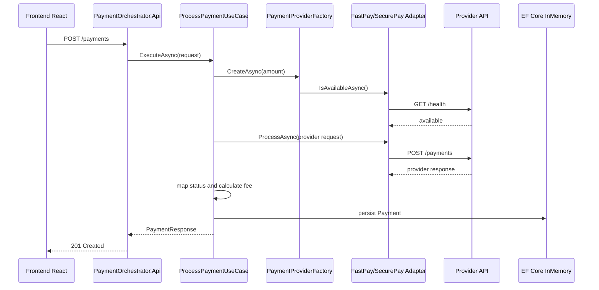

# PayFlow

PayFlow e uma solucao full stack para orquestracao de pagamentos entre provedores externos com contratos diferentes. A aplicacao recebe uma solicitacao de pagamento, escolhe o provedor mais adequado pela politica de roteamento, executa a transacao no provedor selecionado, aplica as regras de taxa, persiste o resultado e devolve uma resposta unificada para o consumidor.

O projeto foi desenvolvido como uma demonstracao de arquitetura orientada a dominio e adaptadores, mantendo o caso de uso principal independente dos contratos especificos de `FastPay` e `SecurePay`.

## Escopo da solucao

A solucao cobre o fluxo principal de processamento de pagamentos:

- Envio de pagamentos pelo frontend React para a API principal.
- Exposicao do endpoint `POST /payments` no `PaymentOrchestrator.Api`.
- Roteamento automatico entre provedores por valor da transacao.
- Simulacao de dois provedores externos independentes: `FastPay.Api` e `SecurePay.Api`.
- Adaptacao de contratos diferentes de provedores para um contrato interno unico.
- Calculo de taxas por provedor.
- Fallback automatico quando o provedor preferencial esta indisponivel.
- Persistencia dos pagamentos processados via EF Core InMemory.
- Testes unitarios para dominio, aplicacao, infraestrutura e contratos.
- Teste de integracao executavel cobrindo contratos, orquestracao e cenarios de falha.

Fora de escopo nesta versao:

- Autenticacao e autorizacao.
- Persistencia em banco relacional externo.
- Idempotencia de pagamento.
- Observabilidade distribuida com tracing/metrics.
- Retentativas com backoff e circuit breaker.
- Conciliacao financeira ou estorno.

## Componentes

```text
PayFlow
|-- api
|   |-- PaymentOrchestrator.Api
|   |-- PaymentOrchestrator.Application
|   |-- PaymentOrchestrator.Domain
|   |-- PaymentOrchestrator.Infrastructure
|   |-- FastPay.Api
|   |-- SecurePay.Api
|   |-- Payment.Orchestrator.UnitTests
|   `-- PaymentOrchestrator.Tests
`-- front
    |-- src
    |-- package.json
    `-- vite.config.ts
```

### Backend

- `PaymentOrchestrator.Api`: API HTTP principal em .NET 9 usando Minimal APIs. Recebe requisicoes, valida o payload e chama o caso de uso.
- `PaymentOrchestrator.Application`: camada de aplicacao com `ProcessPaymentUseCase` e portas (`IPaymentProvider`, `IPaymentProviderFactory`, `IPaymentRepository`).
- `PaymentOrchestrator.Domain`: entidades, enums e regras de dominio, incluindo `Payment` e `PaymentFeeCalculator`.
- `PaymentOrchestrator.Infrastructure`: implementacoes concretas das portas, adapters HTTP dos provedores, factory de roteamento e repositorio EF Core.
- `FastPay.Api` e `SecurePay.Api`: servicos simulados para representar provedores externos com contratos proprios.

### Frontend

- Aplicacao React + Vite + TypeScript.
- Interface para enviar pagamentos reais ao backend.
- Exibicao do ultimo resultado processado com provedor, status, valor bruto, taxa e valor liquido.
- Historico local das ultimas transacoes feitas na tela.
- Configuracao da URL da API por `VITE_API_BASE_URL`, com padrao `https://localhost:7267`.

## Fluxo de pagamento



## Regras de negocio

### Selecao de provedor

- Pagamentos abaixo de `100.00` usam `FastPay` como provedor preferencial.
- Pagamentos iguais ou acima de `100.00` usam `SecurePay` como provedor preferencial.
- Se o provedor preferencial estiver indisponivel, a aplicacao tenta o outro provedor.
- Se ambos falharem, a API retorna erro `503 Service Unavailable`.

### Taxas

- `FastPay`: `3.49%` sobre o valor bruto.
- `SecurePay`: `2.99%` sobre o valor bruto + taxa fixa de `0.40`.
- As taxas sao arredondadas para cima no centavo.

Exemplo:

```text
Valor bruto: 120.50
Provedor: SecurePay
Taxa: 4.01
Valor liquido: 116.49
```

## Decisoes tecnicas e arquitetura

### Separacao por camadas

O backend foi separado em `Domain`, `Application`, `Infrastructure` e `Api` para reduzir acoplamento e deixar explicito onde cada tipo de decisao vive:

- `Domain` contem regras puras, sem dependencia de framework ou HTTP.
- `Application` orquestra o caso de uso e depende apenas de abstracoes.
- `Infrastructure` conhece HTTP, EF Core, configuracoes e implementacoes externas.
- `Api` fica responsavel pela borda HTTP, CORS, validacao inicial e traducao de erros.

Essa separacao permite testar regras e casos de uso sem subir servidores reais, alem de facilitar a troca de adapters e persistencia.

### Ports and Adapters

Os provedores sao acessados atraves da porta `IPaymentProvider`. Cada provedor externo tem um adapter proprio:

- `FastPayAdapter` converte o contrato interno para `transaction_amount`, `payer`, `installments` e `description`.
- `SecurePayAdapter` converte o contrato interno para `amount_cents`, `currency_code` e `client_reference`.

Com isso, o caso de uso nao conhece os formatos externos. Para adicionar um novo provedor, a mudanca esperada e criar um novo adapter, registra-lo na injecao de dependencia e atualizar a politica de selecao.

### Factory para roteamento e fallback

`PaymentProviderFactory` centraliza a decisao de escolha do provedor. A politica atual usa valor da transacao e disponibilidade:

- Escolhe o provedor preferencial pelo valor.
- Consulta disponibilidade via adapter.
- Retorna fallback quando necessario.

O `ProcessPaymentUseCase` tambem protege a execucao do pagamento: se a chamada ao provedor escolhido falhar durante o processamento, tenta o provedor alternativo antes de retornar falha ao cliente.

### Contrato interno unico

A aplicacao usa `ProviderPaymentRequest` e `ProviderPaymentResult` como modelos internos para provedores. Isso evita que diferencas de nomes, unidades e status dos provedores vazem para as camadas de aplicacao e dominio.

### Normalizacao de status

Os provedores usam status diferentes:

- `FastPay` retorna `approved`.
- `SecurePay` retorna `success`.

O use case normaliza os retornos para o enum de dominio `PaymentStatus`, expondo `approved` ou `rejected` na resposta publica.

### Calculo de taxas no dominio

O calculo de taxa esta em `PaymentFeeCalculator`, dentro do dominio, porque faz parte da regra de negocio do pagamento. A taxa e calculada antes da criacao da entidade `Payment`, que guarda valor bruto, taxa e valor liquido.

### Persistencia com EF Core InMemory

Foi escolhido EF Core InMemory para manter o desafio simples e executavel localmente sem infraestrutura externa. Ainda assim, o acesso a dados passa por `IPaymentRepository`, o que preserva a possibilidade de substituir por SQL Server, PostgreSQL ou outro banco sem alterar o caso de uso.

### Minimal API

`PaymentOrchestrator.Api` usa Minimal API para manter a borda HTTP objetiva e com pouco codigo incidental. A validacao usa Data Annotations no request e retorna `ValidationProblemDetails` quando o payload e invalido.

### HttpClientFactory

Os adapters usam `AddHttpClient`, com base URL configurada em `appsettings.json` e timeout de 5 segundos. Essa decisao evita instanciacao manual de `HttpClient`, centraliza configuracao e prepara o codigo para evolucoes como resiliencia e policies.

### Configuracao por appsettings e variaveis

Endpoints e flags de disponibilidade dos provedores ficam em:

```json
{
  "PaymentProviders": {
    "Endpoints": {
      "FastPay": "http://localhost:5271",
      "SecurePay": "http://localhost:5272"
    },
    "Availability": {
      "FastPay": true,
      "SecurePay": true
    }
  }
}
```

Isso permite simular indisponibilidade por configuracao ou parando os servicos externos.

### CORS restrito ao frontend local

A API principal libera CORS para `localhost:8080` e `127.0.0.1:8080`, que sao as origens usadas pelo Vite no ambiente local.

### Frontend desacoplado da regra de negocio

O frontend nao replica decisao de roteamento, calculo de taxa ou status. Ele apenas envia `amount` e `currency` para a API e renderiza a resposta real. Essa decisao evita divergencia entre UI e backend.

### Testabilidade

A solucao possui testes unitarios para:

- Validacao de requests e responses.
- Caso de uso de processamento.
- Calculo de taxas.
- Entidade `Payment`.
- Factory de provedores.
- Adapters e contratos de provedores.
- Persistencia EF Core.
- Injecao de dependencia.

Tambem ha um teste de integracao em `PaymentOrchestrator.Tests` que sobe os servicos, valida contratos HTTP e cobre fallback quando provedores falham.

## Endpoint principal

```http
POST https://localhost:7267/payments
Content-Type: application/json

{
  "amount": 120.50,
  "currency": "BRL"
}
```

Resposta:

```json
{
  "id": 1,
  "externalId": "SP-19283",
  "status": "approved",
  "provider": "SecurePay",
  "grossAmount": 120.50,
  "fee": 4.01,
  "netAmount": 116.49
}
```

## Como executar

### Backend

Abra terminais separados para os provedores e para o orquestrador:

```powershell
cd C:\repo\PayFlow\api
dotnet run --project .\FastPay.Api\FastPay.Api.csproj
```

```powershell
cd C:\repo\PayFlow\api
dotnet run --project .\SecurePay.Api\SecurePay.Api.csproj
```

```powershell
cd C:\repo\PayFlow\api
dotnet run --launch-profile https --project .\PaymentOrchestrator.Api\PaymentOrchestrator.Api.csproj
```

URLs padrao:

- PaymentOrchestrator: `https://localhost:7267`
- FastPay: `http://localhost:5271`
- SecurePay: `http://localhost:5272`

### Frontend

```powershell
cd C:\repo\PayFlow\front
npm install
npm run dev
```

URL padrao:

```text
http://localhost:8080
```

Para alterar a URL da API:

```env
VITE_API_BASE_URL=https://localhost:7267
```

## Testes

### Backend

```powershell
cd C:\repo\PayFlow\api
dotnet test
```

### Frontend

```powershell
cd C:\repo\PayFlow\front
npm test
npm run lint
npm run build
```

## Referencias internas

- [README da API](api/README.md)
- [README do frontend](front/README.md)
